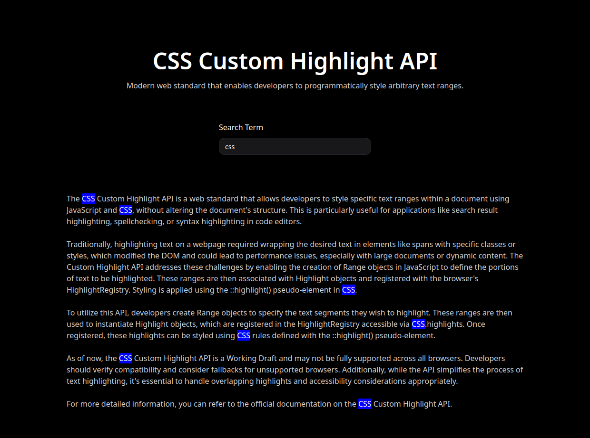

# useSearchHighlight Hook

The `useSearchHighlight` hook is a custom React hook that enables efficient text highlighting within a specified container element using the CSS Custom Highlight API. This approach allows for dynamic and performance-friendly text highlighting without modifying the DOM structure.



## Features

- **Dynamic Highlighting**: Highlights text within a specified container based on the provided search term.
- **Performance Optimized**: Utilizes the CSS Custom Highlight API to apply styles without altering the DOM, ensuring efficient rendering.
- **Customizable**: Allows specifying the container element and initial search term.

## Installation

Ensure your project supports the CSS Custom Highlight API, as browser compatibility may vary. For more information, refer to the [MDN Web Docs](https://developer.mozilla.org/en-US/docs/Web/API/CSS_Custom_Highlight_API).

## Usage

Import the `useSearchHighlight` hook into your component:


```tsx
import { useSearchHighlight } from './path/to/useSearchHighlight';
```


Use the hook within your component, specifying the container selector and initial search term:


```tsx
const MyComponent = () => {
  const { searchTerm, setSearchTerm } = useSearchHighlight('#my-container', 'initial search term');

  // Your component logic
};
```


In your CSS, define the highlight styles using the `::highlight` pseudo-element:


```css
::highlight(search-highlight) {
  background-color: yellow;
  color: black;
}
```


Replace `'search-highlight'` with the identifier used in your hook if different.

## Browser Compatibility

The CSS Custom Highlight API is a working draft and may not be fully supported across all browsers. Developers should verify compatibility and consider fallbacks for unsupported browsers. For more information, refer to the [MDN Web Docs](https://developer.mozilla.org/en-US/docs/Web/API/CSS_Custom_Highlight_API).

## License

This project is licensed under the MIT License. 
